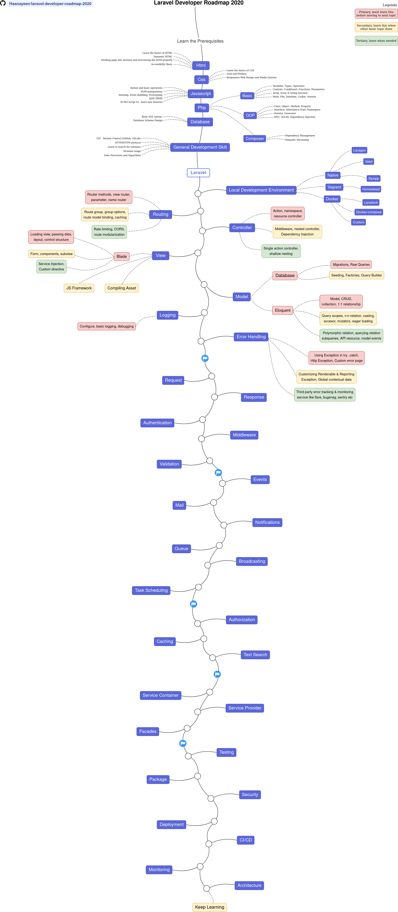

# Laravel Developer Roadmap 2020

### Roadmap to becoming a Laravel developer in 2020

Below is a simple roadmap charts demonstrating the paths that you can take and the technologies that you would want to adopt in order to become a laravel developer.

> This is simply a guide to give you an idea. It helps you navigate the ecosystem and pickup topics to learn as you go so that you don't get overwhelmed.

Roadmap for other technology can be found [here](https://github.com/liuchong/awesome-roadmaps)

## Roadmap

## How to use

Start at the top, if you don't know the pre requisites, first learn those. Then start at laravel and learn each topic serially. For each topic, first learn the essentials (primary, marked in red background). Then you can go to next topic and learn its essentials. After you learn first few basic topic, you can come back to first topic again and learn the secondary knowledge (marked in yellow background) and when done go to next topic and learn its secondary and so on.

## Resources

1. Prerequisites
    1. HTML
        * Learn the basics of HTML
        * Make a few pages as an exercise
    2. CSS
        * Learn the basics of CSS
        * Style pages from previous step
        * Build a page with grid and flexbox
    3. JS Basics
        * Get familiar with the syntax
        * Learn basic operations on DOM
        * Learn mechanisms typical for JS (Hoisting, Event Bubbling, Prototyping)
        * Make some AJAX (XHR) calls
        * Learn new features (ECMA Script 6+)
    4. PHP Basics
        * Basic PHP setup
        * Learn basic syntax
        * Learn about control flow, conditional, function, parameters
        * Learn array, array function & string function
        * Learn to work with Math, Datetime, File, Cookie & Session
    5. PHP OOP
        * Learn about Class, Object, Property, Method
        * Learn Inheritance, Interface, Trait, Namespace
        * Learn about Iterator & Generator
        * Learn about MVC pattern, SOLID principles and Dependency Injection
    6. Composer
        * Learn about dependency management
        * Learn to use composer
        * Learn about semantic versioning
2. General Development Skills
    1. Learn GIT, create a few repositories on GitHub, share your code with other people
    2. Know HTTP(S) protocol, request methods (GET, POST, PUT, PATCH, DELETE, OPTIONS)
    3. Don't be afraid of using Google, [Power Searching with Google](http://www.powersearchingwithgoogle.com/)
    4. Get familiar with terminal, configure your shell (bash, zsh, fish)
    5. Read a few books about algorithms and data structures
3. Learn about Laravel on [official website](https://laravel.com/docs) or watch this [series](https://laracasts.com/series/laravel-6-from-scratch)

More coming soon.......

## Contribution

I tried to make this as streamlined and sequential as possible. If you think the roadmap can be improved, please do open a PR with any updates and submit any issues. Also, I will continue to improve this, so you might want to star this repository to revisit.

The roadmap is built using [Draw.io](https://www.draw.io/). Project file can be found at `/src` directory. To modify it, open draw.io, click **Open Existing Diagram** and choose `xml` file with project. It will open the roadmap for you. Update it, save the xml and png(export as png) in the repo and create a PR.

- Open a pull request with improvements
- Discuss ideas in issues
- Spread the word
- Reach out with any feedback 

## License

This project is licensed under [MIT](LICENSE)